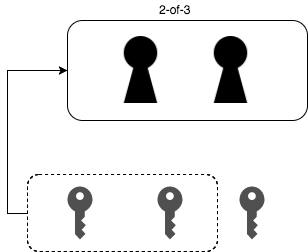
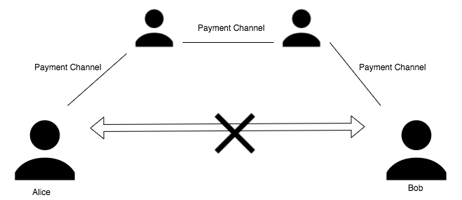
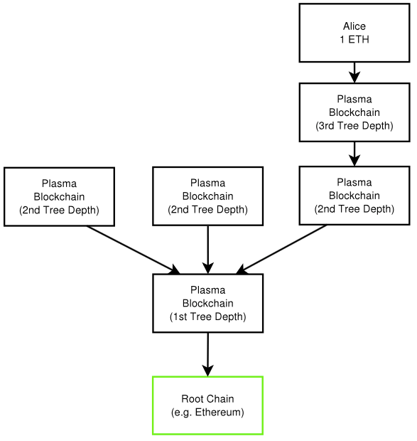
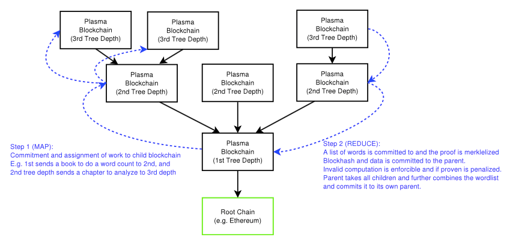
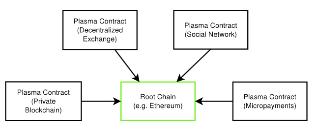
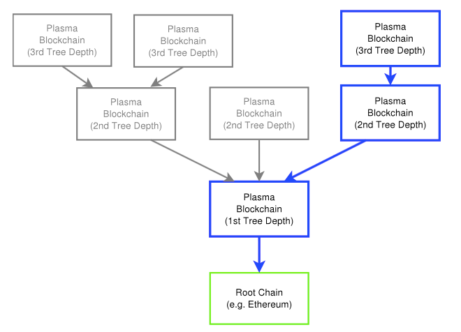
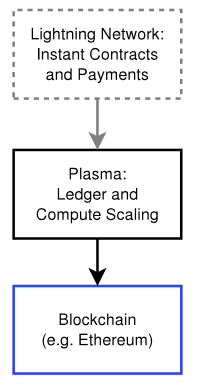

### Raiden and Plasma

---

### 私
*所属*

- @shinanonozenji_
- DMM.com Labo
- ビッグデータ部
- レコメンドチーム

---

### 私
*やってること*

- DevOps
  - Kubernetes, Spinnaker, Istio
- API
  - Akka HTTP, Play
- Recommend Batch
  - Spark
- SQLちょと苦手

---

### 私
*Next Currency*

- Wallet周りのアーキテクチャ設計

---

### ゴール

- ブロックチェーンのスケーラビリティ問題を理解する
- EthereumのRaiden, Plasmaについて理解する

---

### スケーラビリティ

---

### スケーラビリティ問題

- 全てのノードが同じタスクを処理している
- 全てのノードが同一の状態を持つ
- ノード数を2倍にしても各ノードのタスク量は同じ
- ノードを増やしてもスケールしない

---

### スケーラビリティへの解決方法

- オフチェーン
- オンチェーン

---

### スケーラビリティへの解決方法 
*オフチェーン*

- タスクの一部をブロックチェーンの外側で処理
- ノード全体でデータを共有する必要がない
- 例
  - Raiden
  - TrueBit
  - Lightning Network

---

### スケーラビリティへの解決方法 
*オフチェーン*

- ブロックチェーンで処理すべきタスク量を減らしているだけ
- スケールしない問題を解決していない
- パフォーマンスの問題は解決できる

<!--- 
なお、少しややこしいですが、Lightning NetworkやRaidenは、ビットコインやイーサリアムとは独立したプラットフォームであり、それら自体はスケーラビリティのあるアーキテクチャとなっています。
-->

---

### スケーラビリティへの解決方法 
*オンチェーン*

- タスクやデータを分割して、分割されたタスクやデータを並列で処理
- 例
  - Plasma
  - シャーディング

---

### 前提知識

---

### 前提知識

- マルチシグアドレス
- ペイメントチャネル
- 単方向ペイメントチャネル
- 双方向ペイメントチャネル
- Lightning Network

---

### 前提知識
*マルチシグアドレス*

- M-of-N
- N個の秘密鍵のうち、M個の秘密鍵で開錠

<!-- .element height="35%" width="35%" -->

---

### 前提知識
*ペイメントチャネル*

- 2-of-2マルチシグアドレスにデポジット
- デポジットの範囲内で高速にやりとり
- 最後の状態をブロックに書き込む
- ブロックへの書き込みは最初と最後の2回

---

### 前提知識
*単方向ペイメントチャネル*

- AliceからBobへの一方向のやりとり
- AliceがAliceとBobの2-of-2マルチシグにデポジット
- デポジットの範囲内でBobにn回やりとり

---

### 前提知識
*双方向ペイメントチャネル*

- AliceとBobの相互のやりとり
- AliceとBobが2-of-2マルチシグにデポジット
- デポジットの範囲内で相互にn回やりとり
- 不正が行われた際は全額回収できる仕組み

---

### 前提知識
*Lightning Network*

- 双方向ペイメントチャネルのリレー
- HTLCで途中の経由で盗めないようになっている

<!-- .element height="50%" width="50%" -->

---

### Raiden

---

### Raiden

- Lightning Networkのアイデアをベースにしている
- オフチェーンでトランザクションを処理する
- ブロック生成を待たないので高速にやりとり可能
- ERC20準拠トークンの受け渡ししかできない

---

### Raiden
*Lightning Networkとの違い*

- Lightning NetworkはBTCのやりとりのみ
- RaidenはERC20準拠トークンがやりとり可能
- ETHはWETHにしてやりとり
- WETH = ETHをERC20にラップしたもの

---

### Raiden
*メリット*

- 書き込みはオープンとクローズのみ
  - 手数料削減
- オフチェーンの取引は公開されない
  - 途中の状態を保持しない
- 例：動画視聴ごとに課金されるサービスの月額支払い
  - いくら使ったかはわかる
  - いつどれだけ使ったかわからない

---

### Raiden
*デメリット*

高額取引に不向き

- あらかじめデポジットした合計量を超えられない
- 経由者もデポジットする必要がある

---

### Raiden
*Raidenの種類*

- μRaiden
- Raiden Network
- Raidos

---

### Raiden
*μRaiden*

- Bug Bountyがメインネットにリリース済み
- 単方向チャネル
- 1対nのユースケース
  - アプリケーション対ユーザーなど
- 専用のRDNトークンのみやりとり可能
- ERC20とERC223は後日対応

---

### Raiden
*Raiden Network*

- テストネットにリリース済み
- 双方向チャネル
- n対nのユースケース
- バケツリレーで転送できる

---

### Raiden
*Raidos*

- 計画段階で開発が開始されていない
- Raiden2.0
- スマートコントラクトの実行をサイドチェーンで行う

---

### Raiden
*ICO*

- Raidenで使うRDNトークンの売り出し
- 類似プラットフォームの乱立を回避
- フルノードの維持費
- サードパーティツールへのインセンティブ

---

### Raiden
*プロジェクト*

- raidEX
  - 高速な分散取引所を実現する
- Trustlines Network
  - 法定通貨のペイメント

---

### Raiden
*課題*

- 中継経路の効率的探索

---

### Plasma

---

### Plasma
*概要*

- 2017年8月に発表
- 実装はまだ
- この情報も変わるかも
- Root Chain にPlasma Chainを接続する
- Plasma Chainに処理を移譲し、最終結果をRoot Chainに書き込む
- Plasma Chainでスマートコントラクト実行可能
- 不正防止機能、fraud proof

---

### Plasma

<!-- .element height="50%" width="50%" -->

---

### Plasma
*処理の詳細*

- Chainの階層構造
- Root ChainでやるタスクをPlasma Chainに送る
- さらに下のChainにタスクを細分化して送る
- 下のChainは処理完了したら上のChainに戻す
- 処理をまとめ上げる
- Root Chainに送信する

---

### Plasma
*処理の詳細*

<!-- .element height="60%" width="60%" -->

---

### Plasma
*処理性能の向上例*

各Chainの処理量が10tx/secだとしたら

- Child Chain x 3 = 30tx/sec
- さらにChild Chain x 3 = 90tx/sec
- さらにChild Chain x 3 = 270tx/sec

---

### Plasma
*カウンターパーティごとに並列計算*

<!-- .element height="70%" width="70%" -->

---

### Plasma
*カウンターパーティごとに並列計算*

<!-- .element height="60%" width="60%" -->

---

### Plasma
*Raidenと併用*

<!-- .element height="20%" width="20%" -->

---

### Plasma
*メリット*

- スマートコントラクトも動作可能
- データサイズが減る
- 並行処理で大きなトランザクションが動かせる

---

### 両者の違い

- raiden
  - トランザクションの高速化
  - トークンの受け渡しを速くする
- plasma
  - MapReduceでスループットの向上
  - ≠ 個々のトランザクションの高速化ではない

---

### 仮想通貨事業やれる方募集